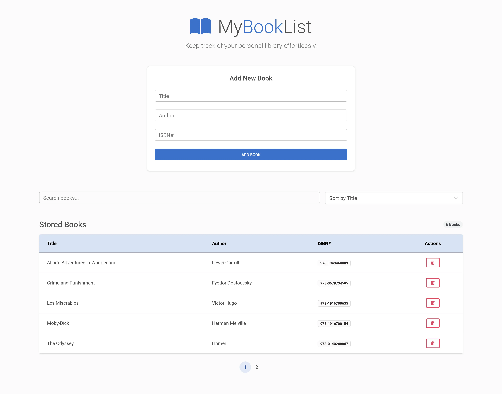

# 📚 MyBookList

A modern, book list management dashboard built with **TypeScript**, **Material Design Bootstrap** and **Object-Oriented Programming** principles. This project demonstrates scalable architecture, and a mobile-first responsive UI.



## 🚀 Technical Stack

- **Framework:** Vite
- **Language:** TypeScript
- **Styling:** Material Design Bootstrap
- **Icons:** FontAwesome 6

## 🛠️ Key Features

- **Advanced Data Processing:** Includes real-time filtering, alphabetical sorting, and dynamic pagination.
- **Persistence:** Uses a decoupled `StorageService` to manage data via Browser LocalStorage.
- **Accessibility (a11y):** Built with semantic HTML5 tags and ARIA labels for screen-reader compatibility.
- **Responsive Design:** Optimized for all screen sizes using Bootstrap's grid system and sticky positioning.

## 🏗️ Architecture & OOP Patterns

This project follows a **Model-View-Controller (MVC)** inspired architecture to ensure a separation of concerns:

1.  **Models (`BookManager.ts`):** Encapsulates business logic. It handles the "Engine" of the app (sorting/filtering) without being tied to the UI.
2.  **UI/Renderer (`Renderer.ts`):** A "dumb" view layer responsible only for DOM manipulation and rendering data provided by the manager.
3.  **Services (`Storage.ts`):** A standalone service for data persistence, making it easy to swap LocalStorage for an API in the future.
4.  **Controller (`main.ts`):** The glue that binds the UI events to the logic and storage services.

## 🚦 Getting Started

### Prerequisites

- Node.js (v18.0 or higher)
- npm or yarn

### Installation

1. Clone the repository:

```bash
 git clone https://github.com/hermanconnor/my-booklist.git
```

2. Install dependencies:

```bash
 npm install
```

### Development

Start the local development server:

```bash
npm run dev
```

### Building for Production

```bash
npm run build
```
